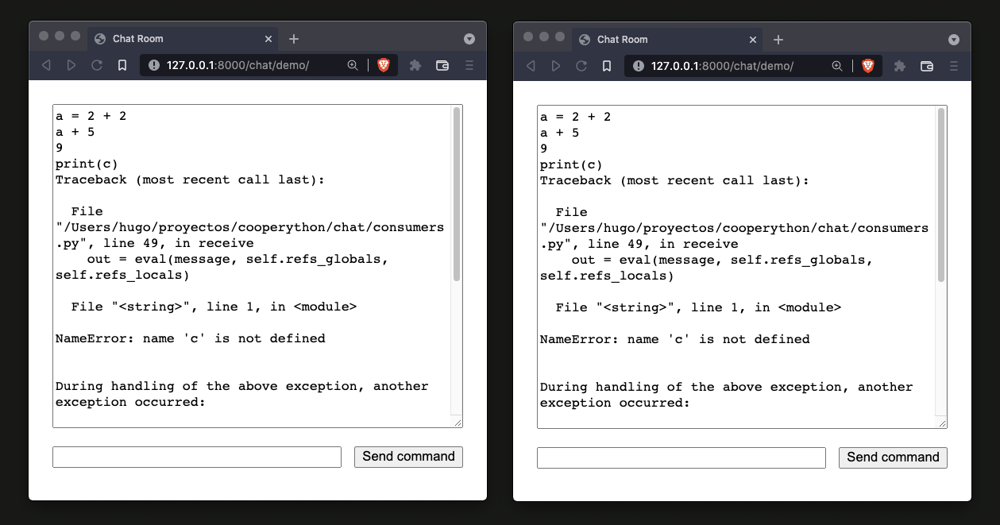

# cooperython


Un intérprete interactivo de python para múltiples usuarios y en el
navegador.




## Desarrollo

Para configurar tu entorno de desarrollo con Docker (y Docker Compose), seguí estos pasos:

```bash
docker-compose build
docker-compose up -d 
```

Si, en cambio, querés utilizar virtualenv, podés instalar las dependnecias con tu entorno levantado:

```bash
pip install -r requirements.txt
```

# 🔥🔥🔥 CUIDADO 🔥🔥🔥

Hicimos este proyecto como un experimento en unas pocas horas, no
uses este sistema en un servidor o entorno productivo, porque todo
el código que ejecuten las personas se evaluarán dentro de un intérprete
de python que corre en el servidor (y que puede acceder al filesystem, acceder
a variables del proceso y un largo listado de cosas peligrosas).
